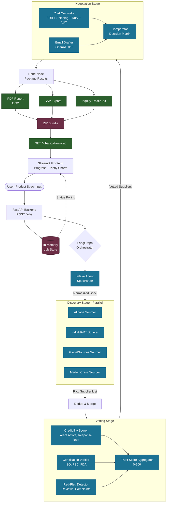

# 🏭 Supplier & Product Sourcing Agent

A multi-agent AI system that automates B2B supplier discovery, vetting, and negotiation.
Built with **LangGraph + FastAPI (backend)** and **Streamlit (frontend)**.

> Reduces supplier sourcing from **2 weeks → 15 minutes** by parallelizing 16 specialized agents.

---

## ✨ Features

- **SpecParser** — normalizes product specs (HS code, materials, certs)
- **Multi-platform Sourcing** — Alibaba, IndiaMART, GlobalSources, Made-in-China (mock + real scraper hooks)
- **Vetting Pipeline** — credibility score, review sentiment, cert verification, red-flag detection, compliance check
- **Negotiation Suite** — price benchmarking, cultural negotiation strategy, personalized inquiry emails, sample request templates
- **Landed Cost Calculator** — FOB + shipping + duty + VAT
- **Decision Matrix** — top 10 suppliers ranked across 12 criteria, exportable to PDF & CSV
- **Streamlit UI** — wizard input, live agent progress, interactive matrix, email editor



## 📸 Screenshots


## 🏗️ Architecture

```
┌──────────────────┐         ┌─────────────────────┐
│  Streamlit UI    │ ◀─────▶ │  FastAPI Backend    │
│  (frontend/)     │  HTTP   │  (backend/)         │
└──────────────────┘         └──────────┬──────────┘
                                        │
                              ┌─────────▼──────────┐
                              │ LangGraph 16-Agent │
                              │   Orchestrator     │
                              └─────────┬──────────┘
                                        │
                  ┌─────────────────────┼─────────────────────┐
                  ▼                     ▼                     ▼
            Discovery (4)         Vetting (5)         Negotiation (6)
```

---

## 🚀 Quick Start

### 1. Setup

```bash
# clone & enter
cd sourcing-agent

# python env
python -m venv venv
source venv/bin/activate          # Windows: venv\Scripts\activate

# install deps
pip install -r requirements.txt

# copy env file & add keys
cp .env.example .env
# edit .env and put your OPENAI_API_KEY=sk-...
```

### 2. Run backend

```bash
cd backend
uvicorn app.main:app --reload --port 8000
```

API docs: http://localhost:8000/docs

### 3. Run frontend (new terminal)

```bash
cd frontend
streamlit run app.py
```

Open http://localhost:8501

---

## 📦 Project Structure

```
sourcing-agent/
├── backend/
│   ├── app/
│   │   ├── main.py                  # FastAPI app + endpoints
│   │   ├── core/
│   │   │   ├── config.py            # env settings
│   │   │   └── llm.py               # OpenAI wrapper
│   │   ├── models/
│   │   │   └── schemas.py           # Pydantic models
│   │   ├── agents/
│   │   │   ├── orchestrator.py      # LangGraph orchestrator
│   │   │   ├── spec_parser.py
│   │   │   ├── sourcers.py          # 4 platform sourcers
│   │   │   ├── vetters.py           # 5 vetting agents
│   │   │   └── negotiators.py       # 6 negotiation/output agents
│   │   └── services/
│   │       ├── mock_data.py         # mock supplier data
│   │       └── report.py            # PDF/CSV export
│   └── __init__.py
├── frontend/
│   └── app.py                       # Streamlit UI
├── data/                            # generated reports land here
├── .env.example
├── requirements.txt
└── README.md
```

---

## 🔑 Environment Variables

Create `.env` in project root:

```
OPENAI_API_KEY=sk-...
OPENAI_MODEL=gpt-4o-mini
BACKEND_URL=http://localhost:8000
```

---

## 🧪 Demo Flow

1. Open Streamlit → enter product spec
   ("Eco-friendly bamboo toothbrush, MOQ 500, target $0.80/unit, FSC + FDA, ship to Berlin")
2. Click **Find Suppliers** → watch 16 agents run live
3. Review **Decision Matrix** with trust scores, prices, red flags
4. Open **Inquiry Emails** tab → personalized per supplier
5. Click **Download Report** → ZIP with PDF + CSV + emails

---
